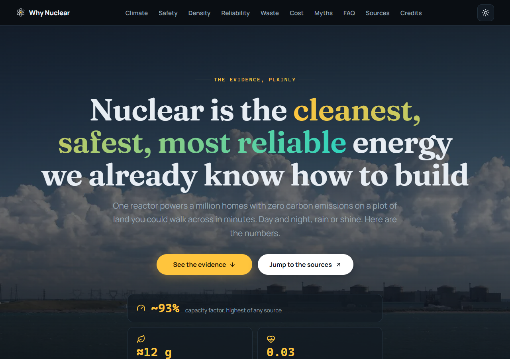
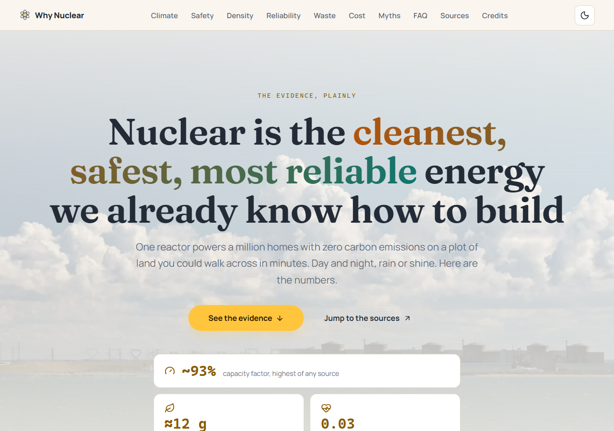

# Why Nuclear

A single-page Astro site making the data-driven case for nuclear energy. Static HTML + CSS,
one tiny script for the nav scrollspy, no chart library, self-hosted fonts, and images
optimized through Astro's asset pipeline.

## Sections

1. **Hero** — full-bleed photo of Gravelines, France's largest plant, with a bento stat block
2. **Stats marquee** — CSS-only infinite band with a WCAG-compliant pause toggle
3. **Climate** — lifecycle CO₂ per kWh (IPCC AR5)
4. **Safety** — deaths per terawatt-hour (Our World in Data), with a CSS-only linear/log
   toggle so the near-zero rows are visible on the log scale
5. **Density** — land footprint per 1,000 MW + fuel pellet comparison (WNA, NEI)
6. **Reliability** — capacity factors, 2023 (U.S. EIA)
7. **Waste** — volume, containment, coal-ash comparison (U.S. NRC, NEI, Scientific American)
8. **Cost** — capital-heavy, 60–80+ year life (IEA, WNA)
9. **The hard part** — an honest section on overruns, policy, and perception
10. **Myth-busting FAQ** — native `
` accordions
11. **Sources & image credits** — every figure and photo linked

## Tech

- **Astro 7** + TypeScript (strict)
- **Self-hosted fonts** — Fraunces Variable (display) + Manrope Variable (body) via Fontsource
- **`astro:assets`** — 11 locally hosted photos, responsive srcsets, WebP, lazy loading
- **`astro-icon`** — 18 Lucide icons, inlined at build time
- **`@astrojs/sitemap`** — generated at build
- **`scripts/verify-credits.mjs`** — build-time license/image verification
- **`scripts/verify-og-images.mjs`** — checks every `og:image` referenced in the built HTML
  exists in `dist/` as a real JPEG/PNG, so a missing share image fails the build
- **`scripts/generate-og-image.mjs`** — renders the 1200×630 social-share cards from the
  site photos with brand fonts (headless Chrome), wired into `og:image` / Twitter cards. The
  three cards are committed to the repo, so the build skips rendering when they're already
  present (pass `--force` to regenerate — needs Chrome; set `CHROME_PATH` if it isn't found)
- **Dark and light themes** — a single token palette with warm paper light mode; the amber
  accent and chart bars stay identical in both. A sun/moon toggle in the nav overrides the
  OS preference and persists the choice in `localStorage` (a tiny `<head>` script sets
  `data-theme` before first paint, so there's no flash; with JS off, the
  `prefers-color-scheme` fallback still applies); `theme-color` metas for each scheme
- **Responsive nav** — desktop row that collapses to a hamburger full-screen panel under
  1024px, so phones *and* tablets get the menu (checkbox + label, no JS for the toggle; the
  tiny scrollspy script also closes the menu on link click or Escape); panel locks body
  scroll and scrolls internally on short viewports
- Accessible (skip link, focus states, `prefers-reduced-motion`, semantic landmarks,
  scrollspy via IntersectionObserver)

## Commands

| Command               | Action                                        |
| :-------------------- | :-------------------------------------------- |
| `npm install`         | Install dependencies                          |
| `npm run dev`         | Start local dev server                        |
| `npm run verify:credits` | Verify image licenses + download missing images |
| `npm run verify:og`    | Verify every `og:image` exists in `dist/` |
| `npm run generate:og` | Regenerate `public/og-image.jpg` from the hero photo |
| `npm run build`       | Verify credits + share images, generate og:images, then build to `dist/` |
| `npm run vercel-build`| Vercel's build: run the full build chain (no Chrome needed — the share cards are committed) |
| `npm run preview`     | Preview the production build                  |

`npm run build` runs `scripts/verify-credits.mjs` (parses `public/CREDITS.md`, confirms
every license still resolves on its Wikimedia file page, downloads any image missing locally;
`--force` re-downloads everything; the build fails if a license or image goes stale),
`scripts/generate-og-image.mjs` (renders the three 1200×630 share cards from the site photos
with the Fraunces/mono branding; the cards are committed, so it skips when they're present —
pass `--force` to re-render; needs Chrome, set `CHROME_PATH` if it isn't found), then
`scripts/verify-og-images.mjs` (scans `dist/` and fails the build if any `og:image` referenced
in the HTML is missing or isn't a real JPEG/PNG).

Social cards use the generated image: `og:image` (1200×630), `og:image:alt`, and
`twitter:card=summary_large_image` are set in the page head, pointing at
`/og-image.jpg`. URLs are built from the `site` in `astro.config.mjs`, so swap in the real
domain before deploying.

## Lighthouse audit

Last audited **2026-08-17** with Lighthouse 13.4.1 (Chrome, mobile emulation) against the
production build served by `astro preview`.

| Category       | Score |
| :------------- | :---- |
| Performance    | 100   |
| Accessibility  | 100   |
| Best Practices | 100   |
| SEO            | 100   |

Key metrics (mobile): LCP 1.5 s, FCP 1.2 s, Speed Index 1.2 s, TBT 0 ms, CLS 0.006.
Zero run warnings; total page weight ~111 KiB.

Both themes were checked after the light theme landed: Lighthouse (which runs the dark theme
on this machine) still scores 100 across all four categories, and an axe-core 4.13 run with
the same WCAG 2.0/2.1/2.2 A+AA rule set Lighthouse uses reports **0 violations in both light
and dark** (light was exercised by emulating `prefers-color-scheme: light` in headless
Chrome).

**Issue found and fixed:** the hero image (the LCP element) was emitted with
`fetchpriority="high"` *and* `loading="lazy"` together — Astro's `<Image>` defaults to lazy,
so the two attributes contradicted each other and delayed the LCP resource. Fixed by setting
`loading="eager" decoding="sync"` on the hero image (below-fold images stay lazy). The LCP
resource load delay dropped from **877 ms to 455 ms**, and Lighthouse's LCP-discovery
checklist (priority hint, discoverable request, no lazy-loading on the LCP resource) now
passes all three items.

**Second audit** (after the light theme, OG image, log-scale toggle, and section reorder
landed): scores still 100 across all four categories, and two real opportunities surfaced.
Both were fixed, with before/after below.

| Opportunity (Lighthouse 13.4) | Before | After |
| :--------------------------- | :----- | :---- |
| Render-blocking CSS          | external `_astro/*.css` request; insight score 0, ~350 ms estimated FCP savings | inlined via `build.inlineStylesheets: 'always'`; insight score 1, nothing flagged |
| Hero image delivery          | ~39 KB WebP at the mobile viewport, ~11.5 KB flagged as removable | quality 75 (it sits behind a dark scrim); ~15 KB served |

Total page weight fell 120 → 111 KiB; observed (unthrottled) LCP 260 ms → 254 ms.

To re-run: `npm run preview -- --port 4322`, then
`npx lighthouse http://localhost:4322/ --output=html --output-path=dist/lighthouse --chrome-path="<path to Chrome>"`.

## Themes

One token palette drives both themes: **dark** is the default; **light** is a warm paper.
The amber accent, chart bars, and the logo stay identical in both — only the surfaces and
text adapt. The nav sun/moon toggle overrides the OS preference and persists the choice in
`localStorage`; first visits follow `prefers-color-scheme` (with a no-JS fallback).

| Dark | Light |
| :--- | :---- |
|  |  |

Both screenshots are captured from the production build (1280×900) with
`node scripts/capture-theme-shots.mjs <base-url>` — regenerate them whenever the hero or
theme tokens change (needs Chrome; set `CHROME_PATH` if it isn't found).

## Fact-check log

Last verified **2026-08-17** against the live source pages. Every figure on the site was
re-checked; the table lists what changed and what survived.

| Source | Checked | Result |
| :----- | :------ | :----- |
| Our World in Data, "What are the safest and cleanest sources of energy?" | deaths per TWh: coal 24.62, oil 18.43, biomass 4.63, gas 2.82, hydro 1.3, wind 0.035, nuclear 0.03 | **Updated** — OWID revised its dataset: nuclear 0.07 → **0.03** (OWID's own Chernobyl/Fukushima estimate), hydro 0.02 → **1.3** (includes Banqiao). Site stat, hero bento, marquee, chart values, "~350× safer than coal" → **~800×**, and all linear/log bar widths updated |
| IPCC AR5 WGIII Annex III | lifecycle gCO₂eq/kWh medians: coal 820, gas 490, solar PV 48, wind ≈12, nuclear 12 | ✓ unchanged |
| U.S. EIA, Electric Power Monthly Table 6.07 | 2023 capacity factors: nuclear 93.0%, gas CC 59.7%, coal 42.4%, wind 33.2%, solar 23.2% | **Updated** — chart rows coal 40→42, wind 35→33, solar 25→23, gas 59→60. Footer link was dead (pointed to an unrelated EIA article); now links to the EPM table |
| World Nuclear Association, "How is uranium made into nuclear fuel?" | pellet ≈ 1 tonne of coal; a 1,000 MW reactor uses ~27 t uranium/yr vs >2.5 Mt coal | **Updated** — density paragraph rewritten to WNA's verified annual figures (replacing an unsourced "2 million times" ratio); pellet stat unchanged |
| NEI, "Land Needs for Wind, Solar Dwarf Nuclear Plant's Footprint" | 1.3 sq mi / 1,000 MW nuclear; solar ~75×; wind ~360× | ✓ values unchanged; citation was misattributed to WNA and its link 404'd — now cites NEI with a working link |
| U.S. NRC / NEI, used-fuel volume | "~10 yards deep on a football field" | ✓ kept — NEI/Duke say "less than 10 yards"; NEI added to the source line since NRC's pages don't state the figure |
| Scientific American, "Coal Ash Is More Radioactive than Nuclear Waste" (2007) | fly ash carries ~100× more radiation to the environment than a nuclear plant per unit energy (per the article's 2008 editor's correction) | **Updated** — site's garbled "more concentrated uranium and thorium than spent fuel" reworded to match the source's corrected claim |
| France's nuclear share (EIA/RTE 2024) | ~65–67% of electricity | **Updated** — FAQ "roughly 70%" → "roughly two-thirds"; "Europe's lowest-carbon electricity" → "some of Europe's lowest-carbon electricity" |
| Link liveness | all footer source URLs | ✓ IEA/IPCC block bots but resolve; WNA uranium link updated to the restructured site; EIA and land-use links replaced as above |

## Image credits

All photos are licensed for reuse with attribution. The footer links to a styled
[`/credits/`](http://localhost:4321/credits/) page that renders every photo with its author,
license badge, and a link to the original Wikimedia Commons file, plus the **full document**
(the download notes, section pairing table, and caveats) in an expandable section. Everything
on the page is generated from [`public/CREDITS.md`](./public/CREDITS.md) at build time — the
entries are parsed for the cards, and the whole file is rendered to HTML with `marked` — so
the machine-readable record (the same file `scripts/verify-credits.mjs` checks) is the single
source of truth; edit the file, rebuild, and the page updates with it.

## Deploy to Vercel

The repo is deploy-ready — the project builds to a fully static site (zero runtime JS beyond
the scrollspy snippet), so Vercel needs no adapter.

1. Push this repo to a Git provider and **Import** it in Vercel. The framework is auto-detected
   (Astro), and [`vercel.json`](./vercel.json) pins `buildCommand: npm run vercel-build`.
2. `vercel-build` is just the normal build chain — it does **not** need Chrome, because the
   three 1200×630 share cards are committed to the repo. `scripts/generate-og-image.mjs`
   skips rendering when they're already present (pass `--force` to re-render). Chrome is
   only needed locally, where `puppeteer-core`/`@puppeteer/browsers` (devDependencies) find
   your system browser.
3. **Site URL:** `astro.config.mjs` resolves `site` from `SITE_URL` → `VERCEL_URL` (set
   automatically on every deploy) → `https://why-nuclear.vercel.app` as the local fallback.
   The `og:image`/Twitter card URLs and the sitemap are built from this, so share cards point
   at the real deployment. Set `SITE_URL` in Vercel to your custom domain once you have one.
4. The build requires network access (credit/license verification hits Wikimedia) and
   Node >= 22.12 (`engines` in `package.json`).

Local `npm run build` behaves identically (no Chrome needed — the cards are already there;
run `npm run generate:og -- --force` to re-render them).
